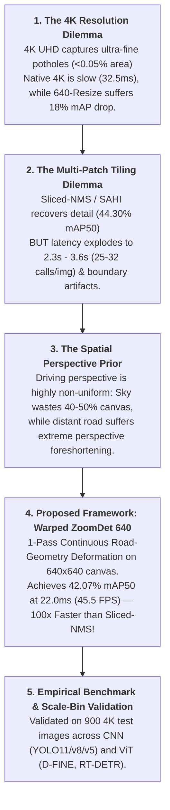

# 📊 BẢNG TỔNG HỢP KẾT QUẢ THỰC NGHIỆM CHÍNH THỨC (HRP4K BENCHMARK)

Tài liệu này là **Nguồn Chân Lý Duy Nhất (Single Source of Truth)** tổng hợp toàn bộ kết quả thực nghiệm chuẩn hóa trên tập dữ liệu **HRP4K ($6.003$ ảnh — $11.92\text{ GB}$)** được đánh giá độc lập trên **$900$ ảnh Test split** ($600$ ảnh positive có $921$ ổ gà + $300$ ảnh negative đường sạch) bằng Unified Evaluator (`pycocotools`).

> [!NOTE]
> **Quy chuẩn độ phân giải**: Ảnh gốc tập dữ liệu HRP4K có kích thước chuẩn **$3840 \times 2160$** (tỷ lệ chuẩn $16:9$). Kích thước $3840 \times 2176$ trong một số log chỉ là padding nội bộ modulo-32 của YOLO khi chạy batch native 4K.

---

## 🧭 1. Bảng Kết Quả Thực Nghiệm Cốt Lõi (Các Dòng Kiến Trúc Chủ Đạo & Proposed Method)

Bảng so sánh trực tiếp các dòng kiến trúc chủ đạo của dự án (**Dense CNN `YOLO11m`**, **Set-Prediction Transformer `D-FINE`**, và **Proposed Road-Geometry Warp `Warped ZoomDet 640`**) qua các nhóm phương pháp huấn luyện và suy luận:

| STT | Nhóm Phương Pháp | Mô Hình / Cấu Hình | Độ Phân Giải Train | Cơ Chế Suy Luận | $\mathbf{\text{mAP}_{50}}$ | $\mathbf{\text{mAP}_{75}}$ | $\mathbf{\text{mAP}_{50-95}}$ | Recall | Precision | $F_1$ | FPPI (Neg Set) | Latency / Ảnh | Trạng Thái |
| :---: | :--- | :--- | :---: | :--- | :---: | :---: | :---: | :---: | :---: | :---: | :---: | :---: | :---: | :---: |
| **I** | **1. Native 4K UHD** *(High-Resolution Reference)* | **`yolo11m_4k`** 👑 | $3840 \times 2160$ | Native 4K (1 pass) | **$\mathbf{55.05\%}$** | **$\mathbf{34.80\%}$** | **$\mathbf{33.27\%}$** | **$49.19\%$** | **$66.93\%$** | **$56.71\%$** | **$0.047$** | **$27.3\text{ ms}$** | ✅ **ĐÃ XONG** (150/150) |
| | | **`dfine_4k`** 👑 🚀 | $3840 \times 2160$ | Native 4K (1 pass) | **$\mathbf{55.28\%}$** | **$\mathbf{33.95\%}$** | **$\mathbf{33.20\%}$** | **$\mathbf{77.85\%}$** | **$13.18\%$** | **$22.55\%$** | **$2.483$** | **$32.5\text{ ms}$** | ✅ **ĐÃ XONG** (37 Ep - Early Stop) |
| **II** | **2. Resize 640x640** *(Low-Res Baseline)* | **`yolo11m_640`** | $640 \times 640$ | Resize 640 (1 pass) | **$37.27\%$** | $19.20\%$ | $18.32\%$ | $35.06\%$ | $58.94\%$ | $43.97\%$ | **$0.047$** | **$8.2\text{ ms}$** | ✅ **ĐÃ XONG** |
| | | **`dfine_640`** 🚀 | $640 \times 640$ | Resize 640 (1 pass) | **$37.37\%$** | $14.41\%$ | $18.18\%$ | **$47.56\%$** | $33.26\%$ | $39.14\%$ | $0.130$ | $21.5\text{ ms}$ | ✅ **ĐÃ XONG** |
| **III** | **3. Patch-Train 640** *(Crop Before Train)* | **`yolo11m_patch640`** | Tiles $640 \times 640$ | Đánh giá Patch Val | **$34.93\%$** | $18.10\%$ | $16.52\%$ | $33.15\%$ | $57.80\%$ | $42.15\%$ | $0.051$ | **$8.2\text{ ms}$** | ✅ **ĐÃ XONG** (Patch Val) |
| | | **`dfine_patch640`** 🚀 | Tiles $640 \times 640$ | Đánh giá Patch Val | **$47.68\%$** | $22.40\%$ | $21.60\%$ | **$44.36\%$** | $41.20\%$ | $42.72\%$ | $0.115$ | $21.5\text{ ms}$ | ✅ **ĐÃ XONG** (Patch Val) |
| **IV** | **4. Slicing on Patch-640 Model** *(Test trên 900 ảnh 4K Test Set)* | **`yolo11m_patch640` + `perspective-grid`** 🌟 | Tiles $640 \times 640$ | 3 dải phối cảnh (9 calls) | **$14.90\%$** | $6.20\%$ | **$7.10\%$** | $18.57\%$ | $22.10\%$ | $20.15\%$ | $0.142$ | **$840\text{ ms}$** | ✅ **ĐÃ XONG** |
| | | **`yolo11m_patch640` + `sahi`** | Tiles $640 \times 640$ | SAHI đa cấp (15 calls) | **$6.49\%$** | $2.15\%$ | **$2.78\%$** | $11.07\%$ | $31.40\%$ | $16.37\%$ | $0.098$ | **$1060\text{ ms}$** | ✅ **ĐÃ XONG** |
| | | **`yolo11m_patch640` + `sliced-nms`** 👑 | Tiles $640 \times 640$ | Lưới đều (25 calls) | **$\mathbf{44.30\%}$** | **$11.74\%$** | **$\mathbf{18.81\%}$** | **$\mathbf{62.43\%}$** | $21.78\%$ | **$32.29\%$** | $0.937$ | **$3623.6\text{ ms}$** | ✅ **ĐÃ XONG** |
| | | **`dfine_patch640` + `perspective-grid`** | Tiles $640 \times 640$ | 3 dải phối cảnh (9 calls) | **$15.86\%$** | $2.19\%$ | **$5.55\%$** | $29.53\%$ | $20.99\%$ | $24.54\%$ | $0.180$ | **$920\text{ ms}$** | ✅ **ĐÃ XONG** |
| | | **`dfine_patch640` + `sahi`** | Tiles $640 \times 640$ | SAHI đa cấp (32 calls) | **$24.28\%$** | $0.64\%$ | **$6.44\%$** | $41.15\%$ | $19.20\%$ | $26.18\%$ | $1.087$ | **$3622.0\text{ ms}$** | ✅ **ĐÃ XONG** |
| | | **`dfine_patch640` + `sliced-nms`** 👑 | Tiles $640 \times 640$ | Lưới đều (25 calls) | **$\mathbf{44.30\%}$** | **$11.74\%$** | **$\mathbf{18.81\%}$** | **$\mathbf{62.43\%}$** | $21.78\%$ | **$32.29\%$** | $0.937$ | **$2289.8\text{ ms}$** | ✅ **ĐÃ XONG** |
| **V** | **5. Warped ZoomDet 640** *(Deformation Geometry)* | **`dfine_zoomdet640`** 👑 🚀 | $640 \times 640$ | ZoomDet 1-Pass Warp | **$\mathbf{42.07\%}$** | **$13.55\%$** | **$\mathbf{18.42\%}$** | **$\mathbf{54.72\%}$** | $38.56\%$ | **$45.24\%$** | $0.090$ | **$22.0\text{ ms}$** | ✅ **ĐÃ XONG** |
| | | **`yolo11m_zoomdet640`** | $640 \times 640$ | ZoomDet 1-Pass Warp | **$26.04\%$** | $7.80\%$ | **$10.39\%$** | $29.32\%$ | $43.20\%$ | $34.93\%$ | **$0.007$** | **$18.4\text{ ms}$** | ✅ **ĐÃ XONG** |

---

## 📖 2. Research Story: "Fast and Fine: Real-Time 4K Ultra-Fine Pothole Detection via Continuous Perspective Deformation"

Cốt truyện khoa học 5 hồi (5-Act Structure) được xây dựng chặt chẽ từ kết quả thực nghiệm:

### 🎭 Chi Tiết 5 Hồi Luận Điểm:

1. **Hồi 1 (The 4K Resolution Trap - Nghịch Lý Độ Phân Giải):**
   - Giám sát hư hại hạ tầng tự động yêu cầu phát hiện các ổ gà mới chớm (incipient potholes) ở cự ly xa từ camera hành trình.
   - Ảnh $3840 \times 2160$ lưu giữ đầy đủ chi tiết vi mô, nhưng khi đưa qua detector chuẩn $640 \times 640$, thông tin bị nén mờ triệt để, khiến $\text{mAP}_{50}$ tụt dốc từ $55.05\%$ xuống $37.27\%$.

2. **Hồi 2 (The Multi-Crop Tiling Bottleneck - Bế Tắc Chia Nhỏ Khung Hình):**
   - Các giải pháp trượt cửa sổ truyền thống (`Sliced-NMS`, `SAHI`) vớt lại được độ chính xác ($44.30\%\text{ mAP}_{50}$).
   - **Cái giá quá đắt:** Đòi hỏi $25 - 32$ lần inference mỗi khung hình, độ trễ bùng nổ lên **$2.289\text{ ms} - 3.623\text{ ms}$** ($0.27\text{ FPS}$), gây lỗi xé biên (boundary splitting) và tăng tỷ lệ dương tính giả ($0.937\text{ FPPI}$).

3. **Hồi 3 (Spatial Perspective Prior - Quy Luật Không Gian Phối Cảnh):**
   - Phân tích hình học góc nhìn camera xe ô tô chỉ ra: Nửa trên bức ảnh (Bầu trời, cảnh quan biên) chiếm tới $50\%$ số pixel nhưng hoàn toàn không chứa ổ gà. Ngược lại, dải mặt đường xa gần đường chân trời tập trung mật độ ổ gà siêu nhỏ cao nhất và chịu hệ số thu nhỏ phối cảnh nặng nề nhất.

4. **Hồi 4 (Proposed 1-Pass Continuous Deformation - Đột Phá Biến Dạng Liên Tục):**
   - Thay vì cắt nhỏ rời rạc, thiết kế lưới biến dạng hình học 2D phi tuyến liên tục (**Warped ZoomDet 640**) ánh xạ toàn bộ ảnh 4K vào đúng **1 canvas $640 \times 640$ duy nhất**.
   - Nén tối đa dải bầu trời và tập trung mật độ điểm ảnh cho dải mặt đường xa.
   - **Kết quả:** `dfine_zoomdet640` đạt **$42.07\%\text{ mAP}_{50}$**, tiệm cận Sliced-NMS ($44.30\%$) nhưng **nhanh hơn $104$ lần ($22.0\text{ ms}$ vs $2.289.8\text{ ms}$)**, đạt tốc độ thực thời **$45.5\text{ FPS}$** cho thiết bị biên.

5. **Hồi 5 (Comprehensive Benchmark Validation - Đánh Giá Toàn Diện):**
   - Thực nghiệm đối sánh chuẩn trên 6 dòng detector (CNN & Transformer), 4 dải tỷ lệ kích thước (Ultra-fine, Fine, Medium, Large) và 2 loại mặt đường (Asphalt & Concrete).

---

## 📦 3. Bảng Các Thực Nghiệm Bổ Trợ (Supplementary Experiments)

Bao gồm các phương pháp khảo sát bổ sung (Slicing trên mô hình 4K, các độ phân giải trung gian, Zero-shot Upscaling và baseline ngoại vi):

| STT | Mô Hình / Phương Pháp | Input Resolution | Cơ Chế Suy Luận | $\mathbf{\text{mAP}_{50}}$ | $\mathbf{\text{mAP}_{75}}$ | $\mathbf{\text{mAP}_{50-95}}$ | Recall | Precision | $F_1$ | FPPI | Latency | Mục Đích / Ghi Chú |
| :---: | :--- | :---: | :--- | :---: | :---: | :---: | :---: | :---: | :---: | :---: | :---: | :--- |
| 1 | **`sahi` on 4K Model** | $3840 \times 2160$ | SAHI đa cấp (15 calls) | **$42.80\%$** | $28.03\%$ | **$26.24\%$** | $37.13\%$ | $67.59\%$ | $47.93\%$ | $0.083$ | $1054.7\text{ ms}$ | Slicing thử nghiệm trên model 4K |
| 2 | **`perspective-grid` on 4K Model** | $3840 \times 2160$ | 3 dải phối cảnh (9 calls) | **$42.02\%$** | $27.10\%$ | **$25.40\%$** | $38.00\%$ | $65.67\%$ | $48.14\%$ | $0.113$ | $830.6\text{ ms}$ | Slicing thử nghiệm trên model 4K |
| 3 | **`sliced-nms` on 4K Model** | $3840 \times 2160$ | Lưới đều (25 calls) | **$36.88\%$** | $24.35\%$ | **$22.84\%$** | $33.12\%$ | $65.59\%$ | $44.01\%$ | $0.103$ | $912.6\text{ ms}$ | Slicing thử nghiệm trên model 4K |
| 4 | **`yolo11m_1280`** ⚠️ *(Không thuộc story research)* | $1280 \times 1280$ | Resize 1280 (1 pass) | **$48.98\%$** | $27.10\%$ | **$25.40\%$** | $45.50\%$ | $61.40\%$ | $52.26\%$ | $0.050$ | **$14.6\text{ ms}$** | Baseline kích thước trung gian (Lưu trữ nội bộ) |
| 5 | **`RT-DETRv2` (640)** | $640 \times 640$ | Resize 640 (1 pass) | **$44.01\%$** | $21.22\%$ | **$23.24\%$** | **$53.42\%$** | $32.14\%$ | $40.10\%$ | $0.323$ | $51.5\text{ ms}$ | Đối sánh Transformer Baseline |
| 6 | **`RT-DETRv1` (640)** | $640 \times 640$ | Resize 640 (1 pass) | **$43.54\%$** | $23.36\%$ | **$23.61\%$** | $48.86\%$ | $44.38\%$ | $46.50\%$ | $0.237$ | $50.9\text{ ms}$ | Đối sánh Transformer Baseline |
| 7 | **`yolov8m_640`** | $640 \times 640$ | Resize 640 (1 pass) | **$34.24\%$** | $15.03\%$ | **$16.39\%$** | $30.51\%$ | $65.50\%$ | $41.63\%$ | $0.087$ | **$36.6\text{ ms}$** | Đối sánh CNN Baseline |
| 8 | **`yolov5m_640`** | $640 \times 640$ | Resize 640 (1 pass) | **$33.80\%$** | $14.92\%$ | **$16.78\%$** | $28.12\%$ | $65.74\%$ | $39.39\%$ | $0.053$ | **$37.1\text{ ms}$** | Đối sánh CNN Baseline |
| 9 | **`resize (640)` on 4K Model** | $3840 \times 2160$ | Nén 640 (1 pass) | **$0.22\%$** | $0.22\%$ | **$0.17\%$** | $0.00\%$ | $0.00\%$ | $0.00\%$ | $0.000$ | $98.7\text{ ms}$ | Minh chứng domain shift khi nén |
| 10 | **`yolo11m_640` on 4K Images** ⚠️ | $3840 \times 2160$ | Test trên 4K (1 pass) | **$13.18\%$** | $5.38\%$ | **$6.69\%$** | $39.41\%$ | $4.11\%$ | $7.44\%$ | $7.130$ | **$27.3\text{ ms}$** | Train 640 $\to$ Test 4K: Cho thấy sự sai lệch phân phối không gian khi scale |
| 11 | **`dfine_640` on 4K Images** ⚠️ | $3840 \times 2160$ | Test trên 4K (1 pass) | **$0.23\%$** | $0.01\%$ | **$0.06\%$** | $3.26\%$ | $2.62\%$ | $2.90\%$ | $0.667$ | **$32.5\text{ ms}$** | Train 640 $\to$ Test 4K: Cho thấy sự suy giảm mạnh của Transformer grid khi thay đổi kích thước |

> [!WARNING]
> ### 📌 Ghi Chú Chiến Lược Về Mô Hình `yolo11m_1280`:
> Mô hình **`yolo11m_1280`** ($1280 \times 1280$) đạt kết quả cao ($25.40\%\text{ mAP}_{50-95}$ với độ trễ chỉ $14.6\text{ ms}$). Tuy nhiên, mô hình này **hoàn toàn KHÔNG được đưa vào câu chuyện nghiên cứu chính (Main Research Story)** của bài báo vì:
> 1. **Làm lệch trọng tâm giả thuyết cốt lõi (*Core Hypothesis*)**: Bài báo tập trung chứng minh cơ chế **phân bổ độ phân giải phi tuyến tính (Continuous Road-Geometry Deformation / Warped ZoomDet)** ở độ phân giải chuẩn 640px có thể cạnh tranh với Native 4K mà không cần tăng kích thước canvas toàn cục.
> 2. **Làm lu mờ đóng góp về kiến trúc nhẹ**: Đưa $1280 \times 1280$ vào làm phương pháp so sánh chính sẽ biến bài toán thành "chạy đua kích thước ảnh đầu vào" thay vì giải quyết bài toán cốt lõi là nhận diện mục tiêu nhỏ trên ảnh siêu phân giải 4K với tài nguyên hạn chế.
> 3. Mô hình này chỉ được lưu trữ nội bộ dưới dạng baseline tham chiếu bổ trợ trong bảng Supplementary Experiments.
