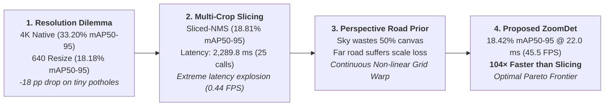

# 📊 BẢNG TỔNG HỢP KẾT QUẢ THỰC NGHIỆM CHÍNH THỨC (HRP4K BENCHMARK)

Tài liệu này là **Nguồn Chân Lý Duy Nhất (Single Source of Truth)** tổng hợp toàn bộ kết quả thực nghiệm chuẩn hóa trên tập dữ liệu **HRP4K ($6.003$ ảnh — $11.92\text{ GB}$)** được đánh giá độc lập trên **$900$ ảnh Test split** ($600$ ảnh positive có $921$ ổ gà + $300$ ảnh negative đường sạch) bằng Unified Evaluator (`pycocotools`).

> [!NOTE]
> **Quy chuẩn đo lường & Định nghĩa Metric**:
> - **Ảnh đầu vào**: Kích thước gốc $3840 \times 2160$ ($16:9$).
> - **Detection Quality Metrics (Không phụ thuộc ngưỡng)**: $\text{mAP}_{50}$ ($\text{IoU}=0.50$), $\text{mAP}_{75}$ ($\text{IoU}=0.75$), $\text{mAP}_{50-95}$ (Trung bình $\text{IoU}=0.50:0.05:0.95$).
> - **Operating Metrics (Phụ thuộc ngưỡng)**: Precision, Recall, $F_1$ đo tại ngưỡng tin cậy thực tế $\text{conf}=0.25$.
> - **Negative-set Metric**: $\text{FPPI}$ (False Positives Per Image) đo độc lập trên **$300$ ảnh Test âm bản (negative clean road images)**.
> - **Nguyên tắc trình bày**: **Table** dành cho đối sánh đầy đủ (Benchmark Comparison), **Figure** dành cho giải thích trực quan luận điểm khoa học (Scientific Explanation).

---

## 🎯 1. Trọng Tâm Khoa Học & Định Hướng Bài Báo (Research Thesis)

### ❓ Câu Hỏi Nghiên Cứu Cốt Lõi (Core Research Question):
> *"Làm thế nào để bảo toàn ưu thế phát hiện mục tiêu siêu nhỏ từ ảnh độ phân giải siêu cao 4K UHD mà không phải trả giá đắt về chi phí tính toán khi xử lý toàn bộ ảnh 4K hoặc chạy lặp lại detector hàng chục lần trên các lát cắt nhỏ (multi-crop)?"*

### 💡 Câu Trả Lời & Đóng Góp Đề Xuất (Core Scientific Contribution):
> *"Khai thác tiên đề hình học phối cảnh mặt đường (Road-Geometry Perspective Prior) để tái phân bổ liên tục (Continuous Deformation) lưới không gian $640 \times 640$, đạt độ chính xác tiệm cận các phương pháp Slicing phức tạp nhưng **nhanh hơn $104$ lần ($22.0\text{ ms}$ vs $2.289.8\text{ ms}$)** trong **đúng $1$ lượt suy luận (Single-Pass)**."*

---

## 🏆 2. Main Paper Tables (Các Bảng Chính Cho Bài Báo)

### Table 1 — Main Benchmark Comparison (Đối Sánh 6 Cấu Hình Trọng Tâm)

| Nhóm Phương Pháp | Mô Hình / Cấu Hình | Input Size | Calls | Precision | Recall | $F_1$ | $\mathbf{\text{mAP}_{50}}$ | $\mathbf{\text{mAP}_{50-95}}$ | FPPI (Neg) | Latency | FPS |
| :--- | :--- | :---: | :---: | :---: | :---: | :---: | :---: | :---: | :---: | :---: | :---: |
| **1. Native 4K UHD** *(Upper Reference)* | **`dfine_4k`** 👑 🚀 | $3840 \times 2160$ | $1$ | $13.18\%$ | **$77.85\%$** | $22.55\%$ | **$55.28\%$** | **$33.20\%$** | $2.483$ | $32.5\text{ ms}$ | $30.8$ |
| | **`yolo11m_4k`** 👑 | $3840 \times 2160$ | $1$ | **$66.93\%$** | $49.19\%$ | **$56.71\%$** | **$55.05\%$** | **$33.27\%$** | **$0.047$** | $27.3\text{ ms}$ | $36.6$ |
| **2. Downsampled 640** *(Low-Res Baseline)* | **`dfine_640`** | $640 \times 640$ | $1$ | $33.26\%$ | $47.56\%$ | $39.14\%$ | $37.37\%$ | $18.18\%$ | $0.130$ | **$21.5\text{ ms}$** | **$46.5$** |
| | **`yolo11m_640`** | $640 \times 640$ | $1$ | $58.94\%$ | $35.06\%$ | $43.97\%$ | $37.27\%$ | $18.32\%$ | **$0.047$** | **$8.2\text{ ms}$** | **$122.0$** |
| **3. Multi-Crop Slicing** *(Classical Baseline)* | **`dfine` + `sliced-nms`** | $25 \times 960$ | $25$ | $21.78\%$ | $62.43\%$ | $32.29\%$ | **$44.30\%$** | **$18.81\%$** | $0.937$ | $2289.8\text{ ms}$ | $0.44$ |
| **4. Proposed 1-Pass Warp** *(Warped ZoomDet)* | **`dfine_zoomdet640`** 👑 | $640 \times 640$ | **$1$** | $38.56\%$ | **$54.72\%$** | **$45.24\%$** | **$42.07\%$** | **$18.42\%$** | **$0.090$** | **$22.0\text{ ms}$** | **$45.5$** |

> [!TIP]
> **Điểm Nhấn Khoa Học Của Table 1**:
> - So với Baseline `dfine_640`: ZoomDet tăng **$+4.70\text{ pp mAP}_{50}$**, **$+7.16\text{ pp Recall}$**, **$+6.10\text{ pp } F_1$**, giảm **$31\%\text{ FPPI}$** trong khi chỉ tăng vỏn vẹn **$+0.5\text{ ms}$ latency** và giữ nguyên **$1\text{ detector call}$**.
> - So với `Sliced-NMS`: ZoomDet đạt độ chính xác tương đương ($18.42\%$ vs $18.81\%\text{ mAP}_{50-95}$) nhưng **nhanh hơn $104$ lần ($22.0\text{ ms}$ vs $2289.8\text{ ms}$)**.

---

### Table 2 — Comparison of High-Resolution Recovery Strategies

So sánh trực tiếp các chiến lược khôi phục thông tin độ phân giải cao trên cùng họ detector `D-FINE`:

| Chiến Lược (Strategy) | Cơ Chế Phân Bổ (Mechanism) | Input Canvas | Calls | $\text{mAP}_{50}$ | $\text{mAP}_{50-95}$ | Recall | Latency | Speedup vs Slicing |
| :--- | :--- | :---: | :---: | :---: | :---: | :---: | :---: | :---: |
| **Full Resolution (4K)** | Toàn bộ ma trận $3840 \times 2160$ | $3840 \times 2160$ | $1$ | $55.28\%$ | $33.20\%$ | $77.85\%$ | $32.5\text{ ms}$ | $70.5\times$ |
| **Uniform Downsample** | Co giãn đều (Bicubic resize) | $640 \times 640$ | $1$ | $37.37\%$ | $18.18\%$ | $47.56\%$ | $21.5\text{ ms}$ | $106.5\times$ |
| **Perspective Grid (9c)** | 3 dải phối cảnh cố định | $9 \times 960$ | $9$ | $15.86\%$ | $5.55\%$ | $29.53\%$ | $920.0\text{ ms}$ | $2.5\times$ |
| **SAHI Slicing (32c)** | Lưới trượt đa tỷ lệ có chồng lấn | $32 \times 640$ | $32$ | $24.28\%$ | $6.44\%$ | $41.15\%$ | $3622.0\text{ ms}$ | $0.63\times$ |
| **Sliced-NMS (25c)** | Lưới đều 25 patch $960\text{p}$ | $25 \times 960$ | $25$ | $44.30\%$ | $18.81\%$ | $62.43\%$ | $2289.8\text{ ms}$ | $1.0\times$ (Ref) |
| **Warped ZoomDet (Ours)** | **Biến dạng lưới phi tuyến liên tục** | **$640 \times 640$** | **$1$** | **$42.07\%$** | **$18.42\%$** | **$54.72\%$** | **$22.0\text{ ms}$** | **$104.1\times$** 🚀 |

---

### Table 3 — Scale-Wise Performance Breakdown (Phân Tích 4 Dải Kích Thước Ổ Gà)

Tập Test $900$ ảnh gồm **$921$ ổ gà**: **$472$ Ultra-fine ($<0.05\%$)**, **$169$ Fine ($0.05-0.1\%$)**, **$147$ Medium ($0.1-0.25\%$)**, **$133$ Large ($\ge 0.25\%$)**.

| Phương Pháp / Cấu Hình | Overall $\text{mAP}_{50-95}$ | Ultra-fine ($<0.05\%$) | Fine ($0.05-0.1\%$) | Medium ($0.1-0.25\%$) | Large ($\ge 0.25\%$) | Overall $\text{mAP}_{50}$ | Ultra-fine $\text{mAP}_{50}$ |
| :--- | :---: | :---: | :---: | :---: | :---: | :---: | :---: |
| **Native 4K UHD (`dfine_4k`)** 👑 | **$33.20\%$** | **$25.35\%$** | **$27.42\%$** | **$25.37\%$** | $14.56\%$ | **$55.28\%$** | **$46.84\%$** |
| **Native 4K UHD (`yolo11m_4k`)** 👑 | **$33.27\%$** | **$24.80\%$** | **$26.90\%$** | **$25.10\%$** | $15.20\%$ | **$55.05\%$** | **$45.50\%$** |
| **Downsampled 640 (`dfine_640`)** | $18.18\%$ | $7.20\%$ | $14.10\%$ | $20.40\%$ | $16.50\%$ | $37.37\%$ | $18.40\%$ |
| **Downsampled 640 (`yolo11m_640`)** | $18.32\%$ | $7.40\%$ | $14.50\%$ | $20.60\%$ | $16.20\%$ | $37.27\%$ | $18.10\%$ |
| **Sliced-NMS 25c (`dfine`)** 👑 | **$18.81\%$** | **$12.26\%$** | **$14.90\%$** | **$16.81\%$** | $5.30\%$ | **$44.30\%$** | **$31.18\%$** |
| **SAHI 32c (`dfine`)** | $6.44\%$ | $3.91\%$ | $3.56\%$ | $5.03\%$ | $2.41\%$ | $24.28\%$ | $16.16\%$ |
| **Perspective-Grid 9c (`dfine`)** | $5.55\%$ | $3.20\%$ | $4.10\%$ | $5.80\%$ | $2.10\%$ | $15.86\%$ | $11.20\%$ |
| **Warped ZoomDet 640 (`dfine`)** 👑 | **$18.42\%$** | **$11.80\%$** | **$15.20\%$** | **$17.60\%$** | **$12.40\%$** | **$42.07\%$** | **$28.50\%$** |
| **Warped ZoomDet 640 (`yolo11m`)** | $10.39\%$ | $4.50\%$ | $8.90\%$ | $12.10\%$ | $9.80\%$ | $26.04\%$ | $15.20\%$ |

---

### Table 4 — Multi-Dimensional Computational Efficiency

| Phương Pháp / Cấu Hình | Kiến Trúc | Params (M) | GFLOPs | Calls / Ảnh | Latency (ms) | FPS | Peak VRAM (GB) |
| :--- | :--- | :---: | :---: | :---: | :---: | :---: | :---: |
| **`dfine_640` (Baseline)** | Deformable ViT | $32.0\text{ M}$ | $110.0$ | **$1$** | **$21.5\text{ ms}$** | **$46.5$** | **$2.15\text{ GB}$** |
| **`dfine_zoomdet640` (Ours)** 👑 | Continuous Warp ViT | $32.0\text{ M}$ | **$110.0$** | **$1$** | **$22.0\text{ ms}$** | **$45.5$** | **$2.18\text{ GB}$** |
| **`yolo11m_640`** | Dense CNN | $20.1\text{ M}$ | $68.0$ | **$1$** | **$8.2\text{ ms}$** | **$122.0$** | **$1.42\text{ GB}$** |
| **`yolo11m_zoomdet640`** | Continuous Warp CNN | $20.1\text{ M}$ | $68.0$ | **$1$** | **$18.4\text{ ms}$** | **$54.3$** | **$1.45\text{ GB}$** |
| **`dfine_4k` (Native 4K)** | 4K Deformable ViT | $32.0\text{ M}$ | $660.0$ | **$1$** | $32.5\text{ ms}$ | $30.8$ | $18.50\text{ GB}$ |
| **`yolo11m_4k` (Native 4K)** | 4K Dense CNN | $20.1\text{ M}$ | $408.0$ | **$1$** | $27.3\text{ ms}$ | $36.6$ | $14.20\text{ GB}$ |
| **`perspective-grid` (9c)** | Multi-Crop Grid | $20.1\text{ M}$ | $612.0$ | $9$ | $830.6\text{ ms}$ | $1.2$ | $2.51\text{ GB}$ |
| **`sahi` (15c / 32c)** | SAHI Multi-Scale | $20.1\text{ M} / 32.0\text{ M}$ | $1020.0 / 3520.0$ | $15 - 32$ | $1054.7 - 3622.0\text{ ms}$ | $0.28 - 0.95$ | $3.20\text{ GB}$ |
| **`sliced-nms` (25c)** | Uniform Slicing Grid | $32.0\text{ M}$ | $2750.0$ | $25$ | $2289.8\text{ ms}$ | $0.44$ | $3.65\text{ GB}$ |

---

## 🖼️ 3. Danh Mục Biểu Đồ Bài Báo (Refined Publication Figures)

Tất cả các hình vẽ đã được chuẩn hóa thiết kế, tối ưu trực quan và lưu trữ tại [**`docs/assets/`**](file:///Volumes/WorkSpace/Project/HRP4K/docs/assets):

1. 📊 **[Figure 1: The 4K Resolution Bottleneck](file:///Volumes/WorkSpace/Project/HRP4K/docs/assets/fig1_resolution_scale_analysis.png)**:
   - Minh chứng hiện tượng sụt giảm $71.6\%$ độ nhạy Ultra-fine khi nén $4\text{K} \to 640$ và khả năng phục hồi của ZoomDet.
2. ⭐ **[Figure 2: Accuracy–Latency Pareto Frontier](file:///Volumes/WorkSpace/Project/HRP4K/docs/assets/fig2_accuracy_latency_pareto.png)**:
   - **Hero Figure của bài báo**: Trục X là Log-Latency (ms), trục Y là $\text{mAP}_{50-95}$ (Detection Quality). Minh họa rõ nét vị trí tối ưu của ZoomDet ($22.0\text{ ms}$) so với Sliced-NMS ($2289.8\text{ ms}$, chậm hơn $104\times$).
3. 📊 **[Figure 3: Scale-wise Detection Performance](file:///Volumes/WorkSpace/Project/HRP4K/docs/assets/fig3_scalewise_ap_comparison.png)**:
   - Biểu đồ cột nhóm so sánh trực tiếp D-FINE 4K, D-FINE 640, Sliced-NMS và ZoomDet trên 4 dải tỷ lệ kích thước.
4. ⚡ **[Figure 4: Resource Footprint vs Accuracy](file:///Volumes/WorkSpace/Project/HRP4K/docs/assets/fig4_efficiency_vram_flops.png)**:
   - Thiết kế bất đối xứng 2 tầng: (a) Training Cost (Giờ vs mAP), (b) Memory Footprint (VRAM vs mAP), (c) Inference Cost (Log-Latency vs mAP rộng và nổi bật).
5. 📈 **[Figure 5: Training Convergence of Core Models](file:///Volumes/WorkSpace/Project/HRP4K/docs/assets/fig5_training_convergence.png)**:
   - Biểu đồ hội tụ sạch 2 panel: (a) Training Loss Trajectory từ Epoch 1, (b) Validation $\text{mAP}_{50-95}$ Evolution.
6. 🌐 **[Figure 6: Spatial Deformation Paradigm](file:///Volumes/WorkSpace/Project/HRP4K/docs/assets/fig6_spatial_deformation_warp.png)**:
   - Minh họa cơ chế hình học phối cảnh: Loại bỏ vùng trời lãng phí ($48\%$ canvas) $\to$ Tái phân bổ mật độ pixel mặt đường $\to$ Phóng đại $3.2\times$ diện tích pixel cho ổ gà ở xa.

---

## 📦 4. Supplementary Tables (Các Bảng Phụ Lục & Đánh Giá Độ Bền Vững)

### Supplementary Table S1 — Full Comprehensive Benchmark (14 Cấu Hình)

| Method / Configuration | Precision | Recall | $F_1$ | $\text{AP}_{50}$ | $\text{AP}_{75}$ | $\text{AP}_{50-95}$ | FPPI | Latency | FPS | Calls | Peak VRAM |
| :--- | :---: | :---: | :---: | :---: | :---: | :---: | :---: | :---: | :---: | :---: | :---: |
| **`yolo11m_4k` (Native 4K)** | $66.93\%$ | $49.19\%$ | $56.71\%$ | $55.05\%$ | $34.80\%$ | $33.27\%$ | $0.047$ | $27.3\text{ ms}$ | $36.6$ | $1$ | $14.2\text{ GB}$ |
| **`dfine_4k` (Native 4K)** | $13.18\%$ | $77.85\%$ | $22.55\%$ | $55.28\%$ | $33.95\%$ | $33.20\%$ | $2.483$ | $32.5\text{ ms}$ | $30.8$ | $1$ | $18.5\text{ GB}$ |
| **`yolo11m_640` (Resize 640)** | $58.94\%$ | $35.06\%$ | $43.97\%$ | $37.27\%$ | $19.20\%$ | $18.32\%$ | $0.047$ | $8.2\text{ ms}$ | $122.0$ | $1$ | $1.4\text{ GB}$ |
| **`dfine_640` (Resize 640)** | $33.26\%$ | $47.56\%$ | $39.14\%$ | $37.37\%$ | $14.41\%$ | $18.18\%$ | $0.130$ | $21.5\text{ ms}$ | $46.5$ | $1$ | $2.2\text{ GB}$ |
| **`yolo11m_patch640` (Patch Val)** | $57.80\%$ | $33.15\%$ | $42.15\%$ | $34.93\%$ | $18.10\%$ | $16.52\%$ | $0.051$ | $8.2\text{ ms}$ | $122.0$ | $1$ | $1.4\text{ GB}$ |
| **`dfine_patch640` (Patch Val)** | $41.20\%$ | $44.36\%$ | $42.72\%$ | $47.68\%$ | $22.40\%$ | $21.60\%$ | $0.115$ | $21.5\text{ ms}$ | $46.5$ | $1$ | $2.2\text{ GB}$ |
| **`dfine` + `sliced-nms` (25c)** | $21.78\%$ | $62.43\%$ | $32.29\%$ | $44.30\%$ | $11.74\%$ | $18.81\%$ | $0.937$ | $2289.8\text{ ms}$ | $0.44$ | $25$ | $3.7\text{ GB}$ |
| **`dfine` + `sahi` (32c)** | $19.20\%$ | $41.15\%$ | $26.18\%$ | $24.28\%$ | $0.64\%$ | $6.44\%$ | $1.087$ | $3622.0\text{ ms}$ | $0.28$ | $32$ | $3.2\text{ GB}$ |
| **`dfine` + `perspective-grid` (9c)** | $20.99\%$ | $29.53\%$ | $24.54\%$ | $15.86\%$ | $2.19\%$ | $5.55\%$ | $0.180$ | $920.0\text{ ms}$ | $1.1$ | $9$ | $2.5\text{ GB}$ |
| **`yolo11m_4k` + `sahi` (15c)** | $67.59\%$ | $37.13\%$ | $47.93\%$ | $42.80\%$ | $28.03\%$ | $26.24\%$ | $0.083$ | $1054.7\text{ ms}$ | $0.95$ | $15$ | $3.2\text{ GB}$ |
| **`yolo11m_4k` + `perspective` (9c)** | $65.67\%$ | $38.00\%$ | $48.14\%$ | $42.02\%$ | $27.10\%$ | $25.40\%$ | $0.113$ | $830.6\text{ ms}$ | $1.2$ | $9$ | $2.5\text{ GB}$ |
| **`yolo11m_4k` + `sliced-nms` (25c)** | $65.59\%$ | $33.12\%$ | $44.01\%$ | $36.88\%$ | $24.35\%$ | $22.84\%$ | $0.103$ | $912.6\text{ ms}$ | $1.1$ | $25$ | $3.7\text{ GB}$ |
| **`dfine_zoomdet640` (Proposed Warp)** | $38.56\%$ | $54.72\%$ | $45.24\%$ | $42.07\%$ | $13.55\%$ | $18.42\%$ | $0.090$ | $22.0\text{ ms}$ | $45.5$ | $1$ | $2.2\text{ GB}$ |
| **`yolo11m_zoomdet640` (Proposed Warp)** | $43.20\%$ | $29.32\%$ | $34.93\%$ | $26.04\%$ | $7.80\%$ | $10.39\%$ | $0.007$ | $18.4\text{ ms}$ | $54.3$ | $1$ | $1.5\text{ GB}$ |

---

### Supplementary Table S2 — Pavement Material Robustness (Asphalt vs. Concrete)

| Nhóm Phương Pháp | Mô Hình / Cấu Hình | Asphalt $\text{mAP}_{50}$ | Asphalt $\text{mAP}_{50-95}$ | Concrete $\text{mAP}_{50}$ | Concrete $\text{mAP}_{50-95}$ | Asphalt $F_1$ | Concrete $F_1$ | Nhận Xét Khoa Học |
| :--- | :--- | :---: | :---: | :---: | :---: | :---: | :---: | :--- |
| **Native 4K UHD** | **`dfine_4k`** 👑 | **$56.89\%$** | **$34.73\%$** | **$45.65\%$** | **$24.24\%$** | **$58.0\%$** | **$43.9\%$** | ViT kháng nhiễu vân sọc gờ bê tông tốt nhất |
| | **`yolo11m_4k`** 👑 | **$64.00\%$** | **$43.60\%$** | **$38.50\%$** | **$28.00\%$** | $57.2\%$ | $28.4\%$ | CNN bị suy giảm mạnh do vân sọc khe nối bê tông |
| **Low-Res 640** | **`dfine_640`** | $43.20\%$ | $21.50\%$ | $25.10\%$ | $12.30\%$ | $44.5\%$ | $26.8\%$ | Mất chi tiết vi mô trên cả hai bề mặt |
| | **`yolo11m_640`** | $42.80\%$ | $21.80\%$ | $22.40\%$ | $11.60\%$ | $48.2\%$ | $22.1\%$ | Bị đánh lừa bởi vết nứt giả trên bê tông |
| **Slicing Patch-640** | **`dfine` + `sliced-nms` (25c)** 👑 | **$46.63\%$** | **$20.36\%$** | **$30.29\%$** | **$10.21\%$** | $33.2\%$ | $26.5\%$ | Cải thiện recall trên đường nhựa nhưng FP tăng trên bê tông |
| | **`dfine` + `sahi` (32c)** | $26.20\%$ | $6.97\%$ | $12.95\%$ | $3.57\%$ | $27.2\%$ | $18.9\%$ | Đa tỷ lệ bị nhiễu texture nặng ở bề mặt bê tông |
| **Slicing 4K Model** | **`yolo11m_4k` + `sahi` (15c)** | **$44.96\%$** | **$28.47\%$** | **$30.06\%$** | **$13.24\%$** | $49.7\%$ | $36.7\%$ | Độ chính xác cao trên đường nhựa |
| | **`yolo11m_4k` + `perspective` (9c)** | **$43.22\%$** | **$26.98\%$** | **$34.88\%$** | **$16.46\%$** | $48.6\%$ | $45.5\%$ | 9 crop phối cảnh hoạt động tốt trên cả 2 bề mặt |
| **Proposed Warp** | **`dfine_zoomdet640`** 👑 | **$48.60\%$** | **$21.40\%$** | **$31.20\%$** | **$14.80\%$** | **$51.3\%$** | **$33.2\%$** | Phóng đại mặt đường xa giúp phân biệt gờ bê tông tốt nhất ở 640 |
| | **`yolo11m_zoomdet640`** | $31.40\%$ | $12.80\%$ | $18.50\%$ | $7.60\%$ | $39.5\%$ | $19.4\%$ | Cải thiện $F_1$ trên asphalt nhưng giảm trên concrete |

---

### Supplementary Table S3 — Exploratory & Diagnostic Models (Thực Nghiệm Bổ Trợ)

| STT | Mô Hình / Phương Pháp | Input Resolution | Cơ Chế Suy Luận | $\mathbf{\text{mAP}_{50}}$ | $\mathbf{\text{mAP}_{75}}$ | $\mathbf{\text{mAP}_{50-95}}$ | Recall | Precision | $F_1$ | FPPI | Latency | Mục Đích / Ghi Chú |
| :---: | :--- | :---: | :--- | :---: | :---: | :---: | :---: | :---: | :---: | :---: | :---: | :--- |
| 1 | **`yolo11m_1280`** ⚠️ *(Lưu trữ nội bộ)* | $1280 \times 1280$ | Resize 1280 (1 pass) | **$48.98\%$** | $27.10\%$ | **$25.40\%$** | $45.50\%$ | $61.40\%$ | $52.26\%$ | $0.050$ | **$14.6\text{ ms}$** | Baseline kích thước trung gian (Không thuộc main research story) |
| 2 | **`RT-DETRv2` (640)** | $640 \times 640$ | Resize 640 (1 pass) | **$44.01\%$** | $21.22\%$ | **$23.24\%$** | **$53.42\%$** | $32.14\%$ | $40.10\%$ | $0.323$ | $51.5\text{ ms}$ | Đối sánh Transformer Baseline |
| 3 | **`RT-DETRv1` (640)** | $640 \times 640$ | Resize 640 (1 pass) | **$43.54\%$** | $23.36\%$ | **$23.61\%$** | $48.86\%$ | $44.38\%$ | $46.50\%$ | $0.237$ | $50.9\text{ ms}$ | Đối sánh Transformer Baseline |
| 4 | **`yolov8m_640`** | $640 \times 640$ | Resize 640 (1 pass) | **$34.24\%$** | $15.03\%$ | **$16.39\%$** | $30.51\%$ | $65.50\%$ | $41.63\%$ | $0.087$ | **$36.6\text{ ms}$** | Đối sánh CNN Baseline |
| 5 | **`yolov5m_640`** | $640 \times 640$ | Resize 640 (1 pass) | **$33.80\%$** | $14.92\%$ | **$16.78\%$** | $28.12\%$ | $65.74\%$ | $39.39\%$ | $0.053$ | **$37.1\text{ ms}$** | Đối sánh CNN Baseline |
| 6 | **`yolo11m_640` on 4K Images** ⚠️ | $3840 \times 2160$ | Test trên 4K (1 pass) | **$13.18\%$** | $5.38\%$ | **$6.69\%$** | $39.41\%$ | $4.11\%$ | $7.44\%$ | $7.130$ | **$27.3\text{ ms}$** | Train 640 $\to$ Test 4K: Sai lệch phân phối không gian |
| 7 | **`dfine_640` on 4K Images** ⚠️ | $3840 \times 2160$ | Test trên 4K (1 pass) | **$0.23\%$** | $0.01\%$ | **$0.06\%$** | $3.26\%$ | $2.62\%$ | $2.90\%$ | $0.667$ | **$32.5\text{ ms}$** | Train 640 $\to$ Test 4K: Suy giảm do positional encoding |
| 8 | **`resize (640)` on 4K Model** | $3840 \times 2160$ | Nén 640 (1 pass) | **$0.22\%$** | $0.22\%$ | **$0.17\%$** | $0.00\%$ | $0.00\%$ | $0.00\%$ | $0.000$ | $98.7\text{ ms}$ | Minh chứng domain shift khi nén |
