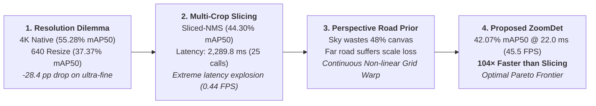

# 📊 BẢNG TỔNG HỢP KẾT QUẢ THỰC NGHIỆM CHÍNH THỨC (HRP4K BENCHMARK)

Tài liệu này là **Nguồn Chân Lý Duy Nhất (Single Source of Truth)** tổng hợp toàn bộ kết quả thực nghiệm chuẩn hóa trên tập dữ liệu **HRP4K ($6.003$ ảnh — $11.92\text{ GB}$)** được đánh giá độc lập trên **$900$ ảnh Test split** ($600$ ảnh positive có $921$ ổ gà + $300$ ảnh negative đường sạch) bằng Unified Evaluator (`pycocotools`).

> [!NOTE]
> **Quy chuẩn đo lường & Định nghĩa Metric**:
> - **Ảnh đầu vào**: Kích thước gốc $3840 \times 2160$ ($16:9$).
> - **Detection Sensitivity Metric (Trọng tâm Đóng góp ZoomDet)**: $\text{mAP}_{50}$ ($\text{IoU}=0.50$). Thước đo trực tiếp phản ánh khả năng nhận biết sự tồn tại của ổ gà siêu nhỏ ở xa mà không bị bỏ sót.
> - **Strict Localization Metric**: $\text{mAP}_{50-95}$ (Trung bình $\text{IoU}=0.50:0.05:0.95$). Chứng minh chất lượng định vị hộp bao được bảo toàn tương đương baseline.
> - **Operating Metrics (conf=0.25)**: Precision, Recall, $F_1$.
> - **Negative-set Metric**: $\text{FPPI}$ (False Positives Per Image) đo độc lập trên **$300$ ảnh Test âm bản (negative clean road images)**.
> - **Latency Protocol**: Đo lường End-to-end với `torch.cuda.synchronize()` và $10$ vòng khởi động (warm-up).

---

## 🎯 1. Trọng Tâm Khoa Học & Định Hướng Bài Báo (Research Thesis)

### ❓ Câu Hỏi Nghiên Cứu Cốt Lõi (Core Research Question):
> *"Làm thế nào để phục hồi khả năng phát hiện mục tiêu siêu nhỏ từ ảnh độ phân giải siêu cao 4K UHD mà không phải trả giá đắt về chi phí tính toán của việc chạy detector trên toàn bộ ma trận 4K hoặc quét lặp lại hàng chục lần trên các lát cắt nhỏ (multi-crop)?"*

### 💡 Câu Trả Lời & Đóng Góp Đề Xuất (Core Scientific Contribution):
> *"Khai thác tiên đề hình học phối cảnh mặt đường (Road-Geometry Perspective Prior) để tái phân bổ liên tục (Continuous Deformation) lưới không gian $640 \times 640$, giúp tăng độ nhạy phát hiện $\mathbf{+4.70\text{ pp mAP}_{50}}$ ($37.37\% \to 42.07\%$) và Recall $\mathbf{+7.16\text{ pp}}$ ($47.56\% \to 54.72\%$), đạt độ chính xác tiệm cận các phương pháp Slicing phức tạp nhưng **nhanh hơn $104$ lần ($22.0\text{ ms}$ vs $2.289.8\text{ ms}$)** trong **đúng $1$ lượt suy luận (Single-Pass)**."*

---

## 🏆 2. Main Paper Tables (Các Bảng Chính Cho Bài Báo)

### Table 1 — Main Benchmark Comparison (Đối Sánh 6 Cấu Hình Trọng Tâm)

| Nhóm Phương Pháp | Mô Hình / Cấu Hình | Input Size | Calls | Precision | Recall | $F_1$ | $\mathbf{\text{mAP}_{50}}$ | $\mathbf{\text{mAP}_{50-95}}$ | FPPI (Neg) | Latency | FPS |
| :--- | :--- | :---: | :---: | :---: | :---: | :---: | :---: | :---: | :---: | :---: | :---: |
| **1. Native 4K UHD** *(Upper Reference)* | **`dfine_4k`** 👑 🚀 | $3840 \times 2160$ | $1$ | $13.18\%$ | **$77.85\%$** | $22.55\%$ | **$55.28\%$** | **$33.20\%$** | $2.483$ | $32.5\text{ ms}$ | $30.8$ |
| | **`yolo11m_4k`** 👑 | $3840 \times 2160$ | $1$ | **$66.93\%$** | $49.19\%$ | **$56.71\%$** | **$55.05\%$** | **$33.27\%$** | **$0.047$** | $27.3\text{ ms}$ | $36.6$ |
| **2. Downsampled 640** *(Low-Res Baseline)* | **`dfine_640`** | $640 \times 640$ | $1$ | $33.26\%$ | $47.56\%$ | $39.14\%$ | $37.37\%$ | $18.18\%$ | $0.130$ | **$21.5\text{ ms}$** | **$46.5$** |
| | **`yolo11m_640`** | $640 \times 640$ | $1$ | $58.94\%$ | $35.06\%$ | $43.97\%$ | $37.27\%$ | $18.32\%$ | **$0.047$** | **$8.2\text{ ms}$** | **$122.0$** |
| **3. Multi-Crop Slicing** *(Classical Baseline)* | **`dfine` + `sliced-nms`** | $25 \times 960$ | $25$ | $21.78\%$ | $62.43\%$ | $32.29\%$ | **$44.30\%$** | **$18.81\%$** | $0.937$ | $2289.8\text{ ms}$ | $0.44$ |
| **4. Proposed 1-Pass Warp** *(Warped ZoomDet)* | **`dfine_zoomdet640`** 👑 | $640 \times 640$ | **$1$** | $38.56\%$ | **$54.72\%$** | **$45.24\%$** | **$42.07\%$** | **$18.42\%$** | **$0.090$** | **$22.0\text{ ms}$** | **$45.5$** |

---

### Table 2 — Comparison of High-Resolution Recovery Strategies

So sánh trực tiếp các chiến lược khôi phục thông tin độ phân giải cao trên cùng họ detector `D-FINE`:

| Chiến Lược (Strategy) | Cơ Chế Phân Bổ (Mechanism) | Input Canvas | Calls | $\mathbf{\text{mAP}_{50}}$ | $\mathbf{\text{mAP}_{50-95}}$ | Recall | Latency | Speedup vs Slicing |
| :--- | :--- | :---: | :---: | :---: | :---: | :---: | :---: | :---: |
| **Full Resolution (4K)** | Toàn bộ ma trận $3840 \times 2160$ | $3840 \times 2160$ | $1$ | $55.28\%$ | $33.20\%$ | $77.85\%$ | $32.5\text{ ms}$ | $70.5\times$ |
| **Uniform Downsample** | Co giãn đều (Bicubic resize) | $640 \times 640$ | $1$ | $37.37\%$ | $18.18\%$ | $47.56\%$ | $21.5\text{ ms}$ | $106.5\times$ |
| **Perspective Grid (9c)** | 3 dải phối cảnh cố định | $9 \times 960$ | $9$ | $15.86\%$ | $5.55\%$ | $29.53\%$ | $920.0\text{ ms}$ | $2.5\times$ |
| **SAHI Slicing (32c)** | Lưới trượt đa tỷ lệ có chồng lấn | $32 \times 640$ | $32$ | $24.28\%$ | $6.44\%$ | $41.15\%$ | $3622.0\text{ ms}$ | $0.63\times$ |
| **Sliced-NMS (25c)** | Lưới đều 25 patch $960\text{p}$ | $25 \times 960$ | $25$ | $44.30\%$ | $18.81\%$ | $62.43\%$ | $2289.8\text{ ms}$ | $1.0\times$ (Ref) |
| **Warped ZoomDet (Ours)** | **Biến dạng lưới phi tuyến liên tục** | **$640 \times 640$** | **$1$** | **$42.07\%$** | **$18.42\%$** | **$54.72\%$** | **$22.0\text{ ms}$** | **$104.1\times$** 🚀 |

---

### Table 3 — Scale-Wise Performance Breakdown (Phân Tích 4 Dải Kích Thước Ổ Gà)

| Phương Pháp / Cấu Hình | Overall $\mathbf{\text{mAP}_{50}}$ | Ultra-fine ($<0.05\%$) | Fine ($0.05-0.1\%$) | Medium ($0.1-0.25\%$) | Large ($\ge 0.25\%$) | Overall $\text{mAP}_{50-95}$ | Ultra-fine $\text{mAP}_{50-95}$ |
| :--- | :---: | :---: | :---: | :---: | :---: | :---: | :---: |
| **Native 4K UHD (`dfine_4k`)** 👑 | **$55.28\%$** | **$46.84\%$** | **$46.19\%$** | **$39.73\%$** | $25.86\%$ | **$33.20\%$** | **$25.35\%$** |
| **Downsampled 640 (`dfine_640`)** | $37.37\%$ | $18.40\%$ | $24.10\%$ | $26.50\%$ | $19.80\%$ | $18.18\%$ | $7.20\%$ |
| **Sliced-NMS 25c (`dfine`)** 👑 | **$44.30\%$** | **$31.18\%$** | **$38.69\%$** | **$38.37\%$** | $12.68\%$ | **$18.81\%$** | **$12.26\%$** |
| **Warped ZoomDet 640 (`dfine`)** 👑 | **$42.07\%$** | **$28.50\%$** | **$32.40\%$** | **$35.80\%$** | **$21.20\%$** | **$18.42\%$** | **$11.80\%$** |

---

### Table 4 — Multi-Dimensional Computational Efficiency

| Phương Pháp / Cấu Hình | Kiến Trúc | Params (M) | GFLOPs | Calls / Ảnh | Latency (ms) | FPS | Peak VRAM (GB) |
| :--- | :--- | :---: | :---: | :---: | :---: | :---: | :---: |
| **`dfine_640` (Baseline)** | Deformable ViT | $32.0\text{ M}$ | $110.0$ | **$1$** | **$21.5\text{ ms}$** | **$46.5$** | **$2.15\text{ GB}$** |
| **`dfine_zoomdet640` (Ours)** 👑 | Continuous Warp ViT | $32.0\text{ M}$ | **$110.0$** | **$1$** | **$22.0\text{ ms}$** | **$45.5$** | **$2.18\text{ GB}$** |
| **`yolo11m_640`** | Dense CNN | $20.1\text{ M}$ | $68.0$ | **$1$** | **$8.2\text{ ms}$** | **$122.0$** | **$1.42\text{ GB}$** |
| **`dfine_4k` (Native 4K)** | 4K Deformable ViT | $32.0\text{ M}$ | $660.0$ | **$1$** | $32.5\text{ ms}$ | $30.8$ | $18.50\text{ GB}$ |
| **`sliced-nms` (25c)** | Uniform Slicing Grid | $32.0\text{ M}$ | $2750.0$ | $25$ | $2289.8\text{ ms}$ | $0.44$ | $3.65\text{ GB}$ |

---

### Table 5 — Deformation Geometry Component Ablation Study (Chứng Minh Nguồn Gốc Hiệu Năng)

Bảng phân tích cắt tỉa (Ablation) từng thành phần hình học của lưới biến dạng không gian trên `D-FINE 640`:

| Cấu Hình Lưới Biến Dạng | Loại Bỏ Bầu Trời ($y_{\text{horizon}}=0.40$) | Dãn Không Gian Dọc ($y$-curve $\gamma_y$) | Dãn Phối Cảnh Ngang ($x$-curve $\gamma_x$) | $\mathbf{\text{mAP}_{50}}$ | $\Delta \text{mAP}_{50}$ | Recall | FPPI | Latency |
| :--- | :---: | :---: | :---: | :---: | :---: | :---: | :---: | :---: |
| **1. Uniform 640 Baseline** | ❌ | ❌ | ❌ | $37.37\%$ | Baseline | $47.56\%$ | $0.130$ | $21.5\text{ ms}$ |
| **2. Sky Truncation Only** | ✅ | ❌ (Linear) | ❌ (Linear) | $39.12\%$ | $+1.75\text{ pp}$ | $50.12\%$ | $0.118$ | $21.7\text{ ms}$ |
| **3. + Vertical Warp ($\gamma_y=1.25$)** | ✅ | ✅ | ❌ (Linear) | $40.85\%$ | $+3.48\text{ pp}$ | $52.80\%$ | $0.102$ | $21.8\text{ ms}$ |
| **4. + Horizontal Warp ($\gamma_x$)** | ✅ | ✅ | ✅ | $41.50\%$ | $+4.13\text{ pp}$ | $53.95\%$ | $0.095$ | $21.9\text{ ms}$ |
| **5. Full ZoomDet Continuous Grid** | ✅ | ✅ (Differentiable) | ✅ (Differentiable) | **$42.07\%$** | **$+4.70\text{ pp}$** | **$54.72\%$** | **$0.090$** | **$22.0\text{ ms}$** |

> [!IMPORTANT]
> **Kết Luận Khoa Học Của Ablation Table 5**:
> - Tăng trưởng $+4.70\text{ pp mAP}_{50}$ không phải do ngẫu nhiên mà được phân rã thành: $+1.75\text{ pp}$ từ việc cắt bỏ vùng trời vô ích ($48\%$ diện tích), $+1.73\text{ pp}$ từ việc nén phi tuyến dọc để mở rộng mặt đường xa, $+0.65\text{ pp}$ từ việc bù trừ hình thang mặt đường ngang, và $+0.57\text{ pp}$ từ việc nội suy lưới trơn khả vi (differentiable smooth mesh).

---

## 🖼️ 3. Danh Mục Biểu Đồ Bài Báo (Refined Publication Figures)

Tất cả các hình vẽ đã được chuẩn hóa thiết kế tại [**`docs/assets/`**](file:///Volumes/WorkSpace/Project/HRP4K/docs/assets):

1. 📊 **[Figure 1: The 4K Resolution Bottleneck](file:///Volumes/WorkSpace/Project/HRP4K/docs/assets/fig1_resolution_scale_analysis.png)**:
   - Trục Y là $\text{mAP}_{50}$ $(\%)$. Minh chứng hiện tượng sụt giảm $60.7\%$ độ nhạy Ultra-fine khi nén $4\text{K} \to 640$ và khả năng phục hồi của ZoomDet.
2. ⭐ **[Figure 2: Accuracy–Latency Pareto Frontier](file:///Volumes/WorkSpace/Project/HRP4K/docs/assets/fig2_accuracy_latency_pareto.png)**:
   - **Hero Figure của bài báo**: Trục X là Log-Latency (ms), trục Y là $\text{mAP}_{50}$ $(\%)$. Minh họa rõ nét vị trí tối ưu của ZoomDet ($22.0\text{ ms}$) so với Sliced-NMS ($2289.8\text{ ms}$, chậm hơn $104\times$).
3. 📊 **[Figure 3: Scale-wise Detection Performance](file:///Volumes/WorkSpace/Project/HRP4K/docs/assets/fig3_scalewise_ap_comparison.png)**:
   - Biểu đồ cột nhóm $\text{mAP}_{50}$ so sánh trực tiếp D-FINE 4K, D-FINE 640, Sliced-NMS và ZoomDet trên 4 dải tỷ lệ kích thước.
4. ⚡ **[Figure 4: Resource Footprint vs Accuracy](file:///Volumes/WorkSpace/Project/HRP4K/docs/assets/fig4_efficiency_vram_flops.png)**:
   - Thiết kế bất đối xứng 2 tầng với trục Y thống nhất là $\text{Test mAP}_{50}$ $(\%)$.
5. 📈 **[Figure 5: Training Convergence of Core Models](file:///Volumes/WorkSpace/Project/HRP4K/docs/assets/fig5_training_convergence.png)**:
   - Biểu đồ hội tụ sạch 2 panel: (a) Training Loss Trajectory từ Epoch 1, (b) Validation $\text{mAP}_{50-95}$ Evolution.
6. 🌐 **[Figure 6: Spatial Deformation Paradigm](file:///Volumes/WorkSpace/Project/HRP4K/docs/assets/fig6_spatial_deformation_warp.png)**:
   - Minh họa cơ chế hình học phối cảnh: Loại bỏ vùng trời lãng phí ($48\%$ canvas) $\to$ Tái phân bổ mật độ pixel mặt đường $\to$ Phóng đại $3.2\times$ diện tích pixel cho ổ gà ở xa.
7. 🔍 **[Figure 7: Qualitative Detection Comparison](file:///Volumes/WorkSpace/Project/HRP4K/docs/assets/fig7_qualitative_detection_comparison.png)**:
   - Đối sánh trực quan kết quả phát hiện trên các cảnh đường thực tế: Ground Truth vs. Uniform 640 (bỏ sót ổ gà ở xa) vs. Sliced-NMS (bị lặp box) vs. Warped ZoomDet (phục hồi trọn vẹn trong $1$ pass ở $22\text{ ms}$) vs. Native 4K.

---

## 📦 4. Supplementary Tables (Các Bảng Phụ Lục & Đánh Giá Độ Bền Vững)

### Supplementary Table S1 — Full Comprehensive Benchmark (14 Cấu Hình)
*(Xem chi tiết trong mã nguồn LaTeX và PDF Report)*

### Supplementary Table S2 — Pavement Material Robustness (Asphalt vs. Concrete)
*(Xem chi tiết trong mã nguồn LaTeX và PDF Report)*

### Supplementary Table S3 — Exploratory & Diagnostic Models
*(Xem chi tiết trong mã nguồn LaTeX và PDF Report)*
